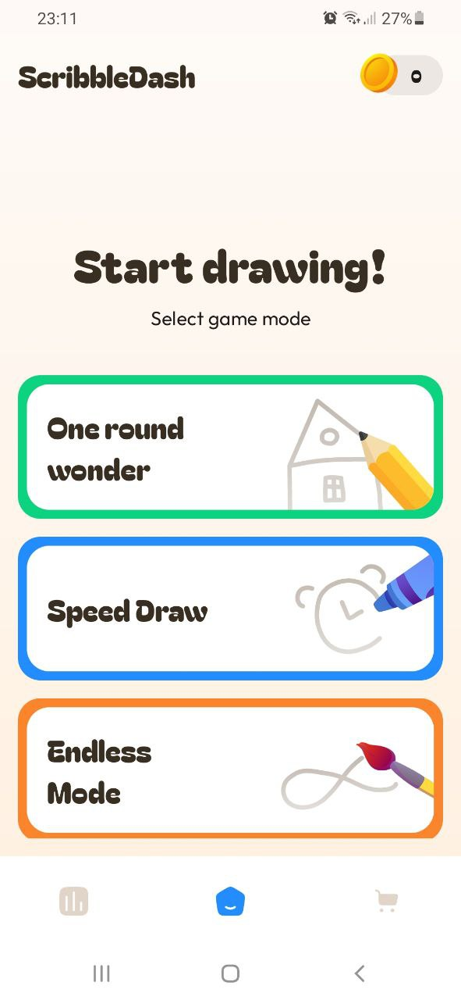
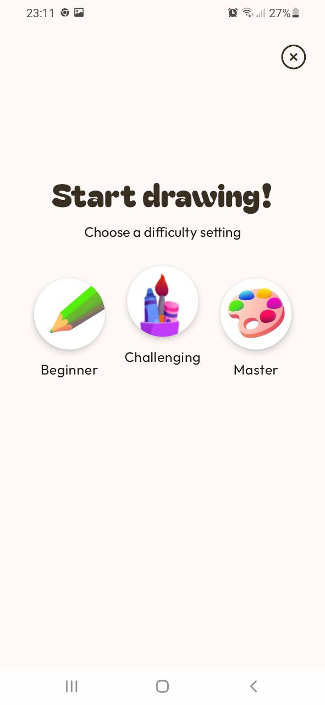
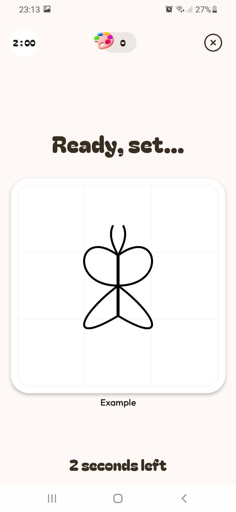
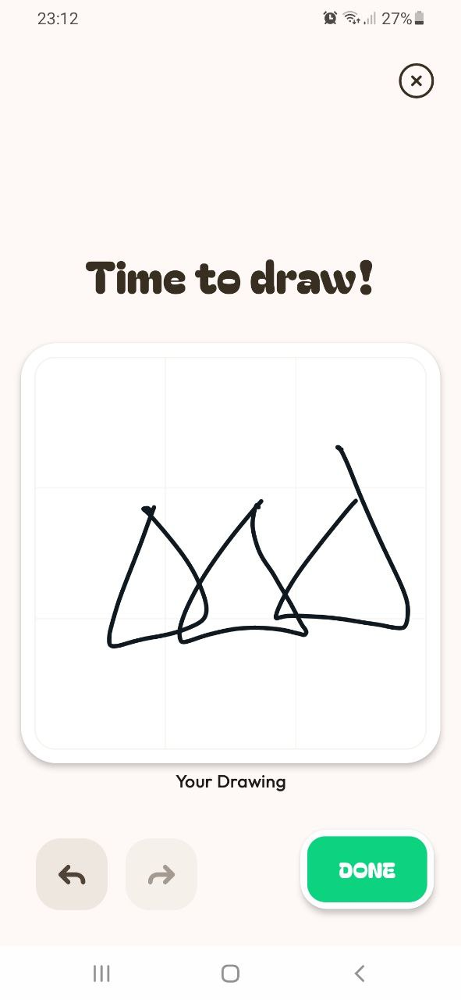
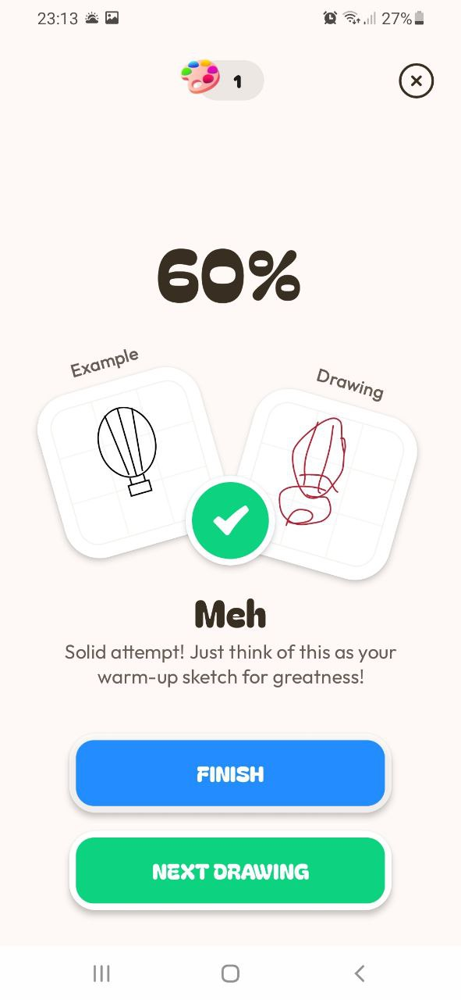
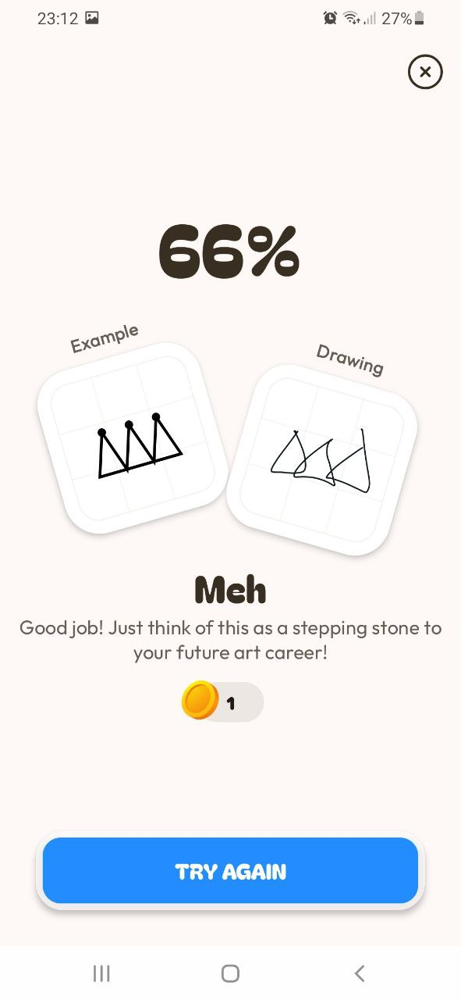
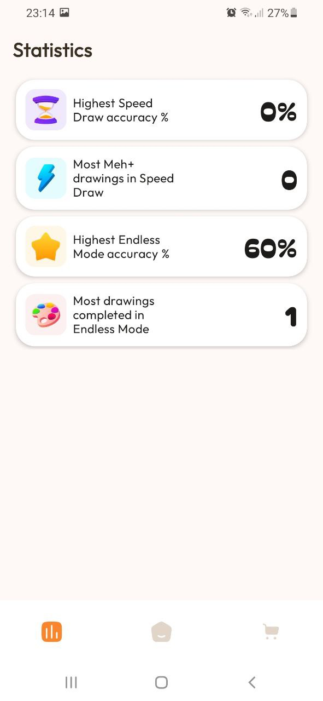
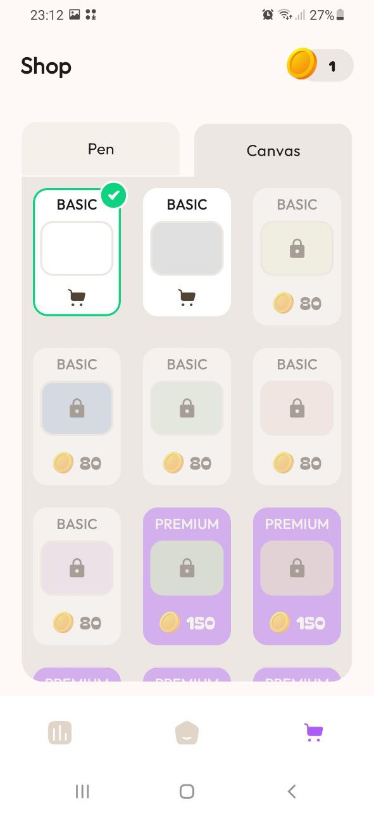
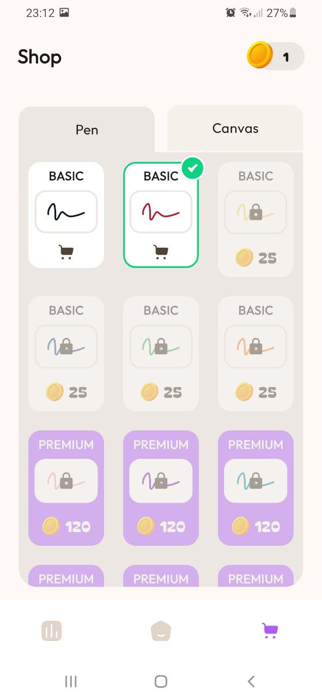

# 🎨 PLScribbleDash

**PLScribbleDash** is a modern, feature-rich Android drawing game app built entirely with Jetpack Compose, inspired by the Mobile Dev Campus Main App Challenge by [Philipp Lackner](https://pl-coding.com/campus).

---

## 🚀 Features

- **🖌 Multiple Game Modes**
  - **One-Round Mode** – Memorize and replicate a drawing after a short preview.
  - **Speed Mode** – Recreate as many drawings as possible against the clock.
  - **Endless Mode** – Draw freely and compete for your best accuracy score.
- **📊 Statistics**
  - Track your high scores, accuracy, and number of games played for each mode.
- **🛍️ Shop System**
  - Unlock and customize canvas backgrounds, pen colors, and more using in-app currency.
- **⚡ Fast & Responsive**
  - Smooth, real-time drawing powered by a custom Compose canvas.
- **📱 Adaptive UI**
  - Beautiful Material 3 design, dark/light themes, landscape & tablet support.

---

## 🏗️ Tech Stack & Architecture

- **Kotlin** + **Jetpack Compose** (100% Compose UI)
- **Clean Architecture** (multi-layered, modular)
- **MVVM + Unidirectional Data Flow**
- **StateFlow** for state management
- **Navigation-Compose**
- **Manual Dependency Injection** (no 3rd party DI)
- **SOLID, DRY, KISS** principles
- **In-memory and simulated data sources**

---

## 🖼️ Screenshots

|  |  |
|:--:|:--:|
| *Home Screen* | *Game Mode Selection* |

|  |  |
|:--:|:--:|
| *Game Preview* | *Game Canvas* |

|  |  |
|:--:|:--:|
| *Result Screen (Normal)* | *Result Screen (Endless Mode)* |

|  |  |
|:--:|:--:|
| *Statistics* | *Shop – Drawboard Customization* |

|  |  |
|:--:|:--:|
| *Shop – Pen Customization* |  |

> _All screenshots are in the [`screenshots/`](screenshots/) folder. Each file name matches the screen title._

---

## 🧠 What You'll Learn

- Custom drawing logic with Jetpack Compose Canvas
- Image/bitmap comparison for scoring accuracy
- StateFlow & Unidirectional Data Flow in Compose
- Modularization and clean project architecture
- Jetpack Compose best practices for real-world apps

---

## 🎥 Demo

_Add a GIF or video demo here if available!_

---

## 🛠️ Getting Started

1. **Clone the repository:**
   ```bash
   git clone https://github.com/XDdevv/PLScribbleDash.git
   ```
2. **Open in Android Studio (Giraffe or newer).**
3. **Sync Gradle and Run.**

---

## 📄 License

This project is open-source and free to use. Attribution is appreciated!  
See [LICENSE](LICENSE) for full details.

---

## 🤝 Connect

- [Email](mailto:undefineduser087@gmail.com)
- [Email2](mailto:rainxchzed@gmail.com)

---

*Built with ❤️ for the Mobile Dev Campus Main App Challenge and the Android developer community!*